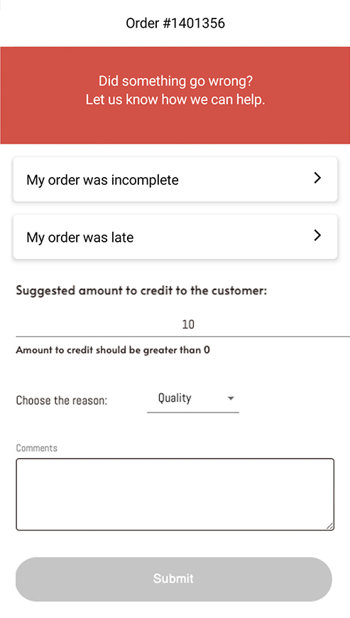

# Summary
This project is a simple CMS(Content Management System) where you can build UIs with drag & drop UI components. CMS generates a JSON and react project has to render UI as in the screenshot.

# Installation
Run an installation script located in the root directory of the project.
```bash
sh install.sh
```
That will automatically do the following:
- Install yarn using [Homebrew](https://brew.sh/), make sure you have [Homebrew](https://brew.sh/) installed.
- Install all the dependencies using yarn.
- Run the project via `yarn dev`

# Testing
Run the following command to run the tests.
```bash
yarn test
```
The testing framework used is `Vitest` and `React Testing Library` for testing the components.

# Project Structure
The project is structured as follows:
- `components` - Contains all the components used in the project.
- `utils` - Contains utility functions used in the project.

# Technologies Used
- [React](https://react.dev/) - For building the UI.
- [Vite](https://vitejs.dev/) - For building the project.
- [Vitest](https://vitest.dev/), [React Testing Library](https://testing-library.com/docs/react-testing-library/intro/) - For testing the components.


# Initial Task
## json-ui-project

##  Summary 
Consider a CMS(Content Management System) where you can build UIs with drag & drop UI components.
CMS generates a JSON and react project has to render UI as in the screenshot. 

## Goal
You need to come up with a JSON structure and build a react project which includes ui components from the screenshot.

## List of Components
* Input
* Dropdown
* Text
* Container (Container component might include other components or another container inside of it)
* etc.


## JSON structure
* I should be able to pass style to every component from JSON.
* I should be able to pass component attributes from JSON (ex: href, src).
* etc.

## Example
* example folder has data.json and data.png which you can check and understand how it worsk

## Result
This task is a little bit ambiguous and we want to know how you would do this. Feel free to use any global state management like redux or context.

## Screenshot
